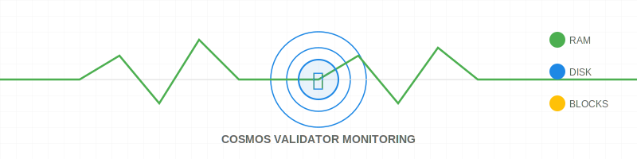
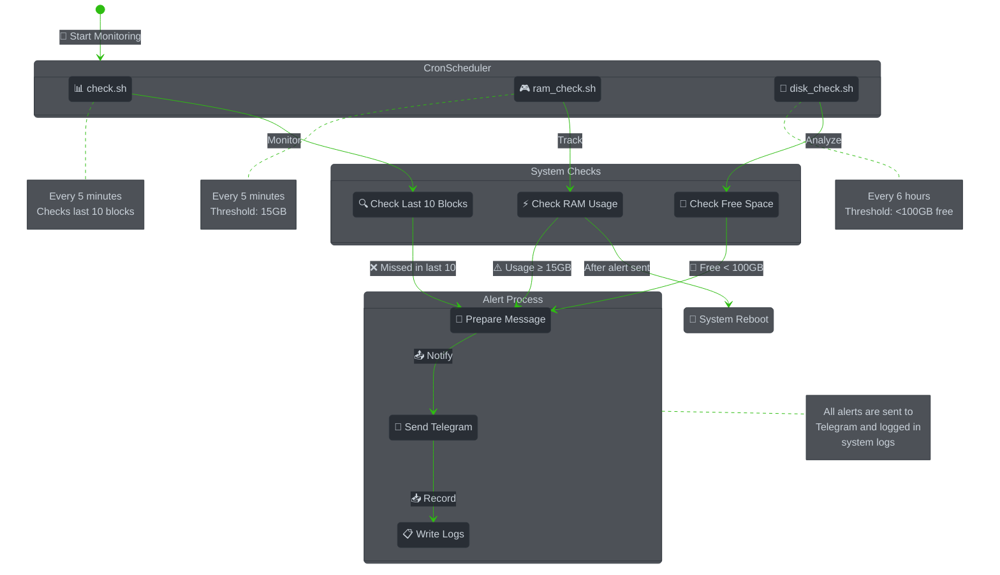

<div align="center" id="top">

# 🛡️ Cosmos Validator Monitoring Tools



*Professional monitoring solution for Cosmos Validators*

> We deliberately chose to use a combination of Bash and Python for this monitoring solution. This hybrid approach ensures both simplicity and reliability, while providing robust endpoint failover capabilities. The system automatically switches to backup RPC endpoints when needed, ensuring continuous monitoring even when primary endpoints fail.

[](https://cosmos.network)
[](https://telegram.org)
[](https://www.python.org/)
[](https://www.gnu.org/software/bash/)
[](./LICENSE)

[🚀 Features](#-features) •
[📋 Requirements](#-requirements) •
[🛠️ Installation](#️-quick-start) •
[🤝 Contributing](CONTRIBUTING.md)

</div>

<hr>

## 🎯 Why Choose This Tool?

<div align="center">
<table>
<tr>
<td width="50%">

### 🔍 Real-time Monitoring
- ⚡ Instant block validation checks
- 🔄 Automatic RPC endpoint failover
- 🌐 Multi-chain support
- 🤖 Automated alert system
- 💽 Regular disk space monitoring
- 🎮 Active RAM usage tracking
- 🤖 Automated alert system

</td>
<td width="50%">

### 🛡️ Proactive Management
- 🔄 Automatic server reboot on high RAM
- 🔍 Smart endpoint selection
- ⚙️ Customizable alert thresholds
- 📱 Telegram notifications
- 📊 Detailed logging system

</td>
</tr>
</table>
</div>

## 🔄 How It Works



## ✨ Features

<div align="center">

| Feature | Description | Check Interval |
|---------|-------------|----------------|
| 🔍 Missed Blocks Detection | Real-time validator performance tracking | Every 5 minutes |
| 🎮 RAM Management | Proactive memory management | Every 5 minutes |
| 💾 Disk Space Monitoring | Regular storage monitoring | Every 6 hours |
| 🔔 Telegram Alerts | Instant notifications | On events |
| 📊 Performance Logs | Comprehensive system logs | Continuous |
| ⚡ Auto-Recovery | Smart reboot system | On RAM alert |

</div>

## 📋 Requirements

<div align="center">

| Requirement | Minimum | Recommended |
|-------------|---------|-------------|
| 🐧 Linux | Ubuntu 20.04 | Ubuntu 22.04 |
| 🔄 curl | 7.68.0 | Latest |
| 🔄 Python | 3.8+ | Latest |
| 🔧 jq | 1.6 | Latest |
| 📱 Telegram Bot | Any | Latest |
| 💻 Bash | 5.0 | Latest |

</div>

Required Python packages:
```bash
pip3 install requests
```

## 🤖 Telegram Bot Setup

1. Create a new bot:
   - Message [@BotFather](https://t.me/BotFather) on Telegram
   - Use `/newbot` command
   - Follow instructions to create bot
   - Copy the provided API token

2. Get Chat ID:
   - Add bot to your group
   - Make bot admin
   - Send any message to group
   - Visit: `https://api.telegram.org/bot<YourBOTToken>/getUpdates`
   - Find "chat" -> "id" in the response

3. Get Thread ID (if using topics):
   - Enable topics in group settings
   - Create new topic
   - Send message in topic
   - Find "message_thread_id" in the getUpdates response

4. Update script variables:
```bash
# Edit check.sh
BOT_TOKEN="YOUR_BOT_TOKEN"
CHAT_ID="YOUR_CHAT_ID"
THREAD_ID="YOUR_THREAD_ID"  # Optional, for topic messages
```

## ⚡ Quick Start

```bash
# Get the tools
git clone https://github.com/Quasar-hub/quasar-server-sentinel.git

# Go to directory
cd quasar-server-sentinel

# Make executable
chmod +x *.sh

# Update script variables
nano check.sh
nano ram_check.sh
nano disk_check.sh

# Set up crontab
crontab -e

# Add these lines:
*/5 * * * * $HOME/quasar-server-sentinel/check.sh <RPC_ENDPOINT> <VALIDATOR_ADDRESS> <CHAIN_ID> <CHAIN_NAME> [LOG_DIR]
*/5 * * * * $HOME/quasar-server-sentinel/ram_check.sh
0 */6 * * * $HOME/quasar-server-sentinel/disk_check.sh

# Verify crontab
crontab -l

# Example:
*/5 * * * * $HOME/quasar-server-sentinel/check.sh http://localhost:26657 76A8A9A8151255E9E69E89499CFE9CB86FD cosmoshub-4 cosmoshub ./logs
```

## 📝 Monitoring Logs

Check your monitoring logs using these commands:

```bash
# Check RAM monitoring logs
cat /var/log/syslog | grep "RAM Monitor"

# Check Disk monitoring logs
cat /var/log/syslog | grep "Disk Monitor"
```

## ⚙️ Configuration

<details>
<summary>📜 <b>Missed Blocks Settings</b> (click to expand)</summary>

```bash
# Script parameters
RPC_ENDPOINT="$1"      # Primary RPC endpoint (usually local)
VALIDATOR_ADDRESS="$2"  # Validator address in hex format 849ASD.....
CHAIN_ID="$3"          # Chain ID (e.g., cosmoshub-4, osmosis-1)
CHAIN_NAME="$4"        # Chain name for endpoint lookup (e.g., cosmoshub, osmosis)
LOG_DIR="${5:-./logs}"  # Directory for log files, default to ./logs if not provided
```
</details>

<details>
<summary>💾 <b>Disk Space Settings</b> (click to expand)</summary>

```bash
# disk_check.sh configuration
FREE_SPACE=100  # Alert when free space is below 100GB
```
</details>

<details>
<summary>🎮 <b>RAM Settings</b> (click to expand)</summary>

```bash
# ram_check.sh configuration
USED_RAM=15    # Alert and reboot when RAM usage exceeds 15GB
```
</details>

## 🔔 Alert Examples

<table>
<tr>
<td>

### 🚫 Missed Blocks
```
⚠️ Alert: Validator Issues
• Missed: 10 consecutive blocks
• Chain: your_chain_id
• Action: Check validator
```

</td>
<td>

### 💾 Storage Alert
```
⚠️ Alert: Low Storage
• Free: 95GB
• Status: Warning
• Action: Cleanup needed
```
### 🔌 Endpoint Failover
```
🔴 cosmoshub-4 - no response from primary or backup endpoints 
(tried 5 additional endpoints) on hostname
```

</td>
</tr>
</table>

## 📊 System Status

```
📊 Monitoring Schedule
┌──────────────┬─────────────┬──────────────┐
│ Service      │ Frequency   │ Next Check   │
├──────────────┼─────────────┼──────────────┤
│ Blocks Check │ 5 minutes   │ Auto         │
│ RAM Check    │ 5 minutes   │ Auto         │
│ Disk Check   │ 6 hours     │ Auto         │
└──────────────┴─────────────┴──────────────┘
```
## 💡 Additional Resources
- [Security Settings](SECURITY.md) - Basic firewall and SSH configuration

## 🤝 Contributing

We welcome contributions! Check our [Contributing Guide](CONTRIBUTING.md) for details.

<div align="center">

| 🐛 [Report Bug](../../issues/new?template=bug_report.md) | 🔀 [Pull Request](../../pulls) | 💡 [Suggest Feature](../../issues/new?template=feature_request.md) |
|-------------------|-----------------|------------------------|

</div>

## 📈 Resource Usage

```
System Impact:
CPU: < 1% average usage
RAM: ~ 50MB memory usage
Disk: ~ 10MB for logs
Network: ~ 1MB/hour
```

## ⭐ Support

If you find this useful:
- 🌟 Star this repository
- 🔄 Fork and contribute
- 📢 Share with others

## 📜 License

<div align="center">

[MIT License](LICENSE) • Free and Open Source

---

<div align="center">

Made with ❤️ by Quasar 🤖🧬🧠 validator

[🔝 Back to Top](#top)

</div>
