<div align="center" id="top">

# 🛡️ Cosmos Validator Monitoring Tools


*Professional monitoring solution for Cosmos Validators*

> We deliberately chose to use pure Bash scripts instead of complex frameworks for this monitoring solution. This approach ensures simplicity, reliability, and minimal system overhead. No additional dependencies to manage, no complex configurations to learn - just efficient, lightweight scripts that get the job done. Perfect for validators who want a robust monitoring system without unnecessary complexity or server load.

[](https://cosmos.network)
[](https://telegram.org)
[](https://www.gnu.org/software/bash/)
[](./LICENSE)

[🚀 Features](#-features) •
[📋 Requirements](#-requirements) •
[🛠️ Installation](#️-quick-start) •
[🤝 Contributing](CONTRIBUTING.md)

</div>

<hr>

## 🎯 Why Choose This Tool?

<div align="center">
<table>
<tr>
<td width="50%">

### 🔍 Real-time Monitoring
- ⚡ Instant block validation checks
- 💽 Regular disk space monitoring
- 🎮 Active RAM usage tracking
- 🤖 Automated alert system

</td>
<td width="50%">

### 🛡️ Proactive Management
- 🔄 Automatic server reboot on high RAM
- ⚙️ Customizable alert thresholds
- 📱 Telegram notifications
- 📊 Detailed logging system

</td>
</tr>
</table>
</div>

## 🔄 How It Works

```mermaid
%%{init: {
  'theme': 'base',
  'themeVariables': {
    'primaryColor': 'rgba(33, 38, 45, 0.8)',
    'primaryTextColor': '#C9D1D9',
    'primaryBorderColor': 'rgba(48, 54, 61, 0.8)',
    'lineColor': '#2ebd11',
    'secondaryColor': 'rgba(33, 38, 45, 0.8)',
    'tertiaryColor': 'rgba(33, 38, 45, 0.8)',
    'noteTextColor': '#C9D1D9',
    'noteBkgColor': 'rgba(33, 38, 45, 0.8)',
    'noteBorderColor': 'rgba(48, 54, 61, 0.8)',
    'labelTextColor': '#C9D1D9',
    'labelBoxBkgColor': 'rgba(33, 38, 45, 0.8)',
    'labelBoxBorderColor': 'rgba(48, 54, 61, 0.8)',
    'stateBkg': 'rgba(33, 38, 45, 0.8)',
    'stateLabelColor': '#C9D1D9',
    'compositeBackground': 'transparent',
    'altBackground': 'rgba(33, 38, 45, 0.8)'
  }
}}%%

stateDiagram-v2
    [*] --> CronScheduler: 🚀 Start Monitoring

    state CronScheduler {
        state "📊 check.sh" as BlocksMonitor
        state "🎮 ram_check.sh" as RAMMonitor
        state "💾 disk_check.sh" as DiskMonitor
        
        note right of BlocksMonitor
            Every 5 minutes
            Checks last 10 blocks
        end note
        note right of RAMMonitor
            Every 5 minutes
            Threshold: 15GB
        end note
        note right of DiskMonitor
            Every 6 hours
            Threshold: <100GB free
        end note
    }
    
    state "System Checks" as Checks {
        state "🔍 Check Last 10 Blocks" as Blocks
        state "⚡ Check RAM Usage" as RAM
        state "📀 Check Free Space" as Disk
    }
    
    BlocksMonitor --> Blocks: Monitor
    RAMMonitor --> RAM: Track
    DiskMonitor --> Disk: Analyze
    
    state "Alert Process" as Alerts {
        state "📝 Prepare Message" as PrepareMsg
        state "📱 Send Telegram" as SendTG
        state "📋 Write Logs" as Log
    }
    
    Blocks --> PrepareMsg: ❌ Missed in last 10
    RAM --> PrepareMsg: ⚠️ Usage ≥ 15GB
    Disk --> PrepareMsg: 💾 Free < 100GB
    
    PrepareMsg --> SendTG: 📤 Notify
    SendTG --> Log: 📥 Record
    
    state "🔄 System Reboot" as Reboot
    
    RAM --> Reboot: After alert sent

    note right of Alerts
        All alerts are sent to
        Telegram and logged in
        system logs
    end note
```



## ✨ Features

<div align="center">

| Feature | Description | Check Interval |
|---------|-------------|----------------|
| 🔍 Missed Blocks Detection | Real-time validator performance tracking | Every 5 minutes |
| 🎮 RAM Management | Proactive memory management | Every 5 minutes |
| 💾 Disk Space Monitoring | Regular storage monitoring | Every 6 hours |
| 🔔 Telegram Alerts | Instant notifications | On events |
| 📊 Performance Logs | Comprehensive system logs | Continuous |
| ⚡ Auto-Recovery | Smart reboot system | On RAM alert |

</div>

## 📋 Requirements

<div align="center">

| Requirement | Minimum | Recommended |
|-------------|---------|-------------|
| 🐧 Linux | Ubuntu 20.04 | Ubuntu 22.04 |
| 🔄 curl | 7.68.0 | Latest |
| 🔧 jq | 1.6 | Latest |
| 📱 Telegram Bot | Any | Latest |
| 💻 Bash | 5.0 | Latest |

</div>

## ⚡ Quick Start

```bash
# Get the tools
git clone https://github.com/Quasar-hub/quasar-server-sentinel.git

# Go to directory
cd quasar-server-sentinel

# Make executable
chmod +x *.sh

# Update script variables
nano check.sh
nano ram_check.sh
nano disk_check.sh

# Set up crontab
crontab -e

# Add these lines:
*/5 * * * * $HOME/quasar-server-sentinel/check.sh
*/5 * * * * $HOME/quasar-server-sentinel/ram_check.sh
0 */6 * * * $HOME/quasar-server-sentinel/disk_check.sh

# Verify crontab
crontab -l
```

## 📝 Monitoring Logs

Check your monitoring logs using these commands:

```bash
# Check RAM monitoring logs
cat /var/log/syslog | grep "RAM Monitor"

# Check Disk monitoring logs
cat /var/log/syslog | grep "Disk Monitor"
```

## ⚙️ Configuration

<details>
<summary>📜 <b>Missed Blocks Settings</b> (click to expand)</summary>

```bash
# check.sh configuration
RPC_ENDPOINT="http://localhost:26657"
VALIDATOR_ADDRESS="your_address"
CHAIN_ID="your_chain_id"    # Chain identifier
THRESHOLD=10                # Alert after 10 consecutive missed blocks
```
</details>

<details>
<summary>💾 <b>Disk Space Settings</b> (click to expand)</summary>

```bash
# disk_check.sh configuration
FREE_SPACE=100  # Alert when free space is below 100GB
```
</details>

<details>
<summary>🎮 <b>RAM Settings</b> (click to expand)</summary>

```bash
# ram_check.sh configuration
USED_RAM=15    # Alert and reboot when RAM usage exceeds 15GB
```
</details>

## 🔔 Alert Examples

<table>
<tr>
<td>

### 🚫 Missed Blocks
```
⚠️ Alert: Validator Issues
• Missed: 10 consecutive blocks
• Chain: your_chain_id
• Action: Check validator
```

</td>
<td>

### 💾 Storage Alert
```
⚠️ Alert: Low Storage
• Free: 95GB
• Status: Warning
• Action: Cleanup needed
```

</td>
</tr>
</table>

## 📊 System Status

```
📊 Monitoring Schedule
┌──────────────┬─────────────┬──────────────┐
│ Service      │ Frequency   │ Next Check   │
├──────────────┼─────────────┼──────────────┤
│ Blocks Check │ 5 minutes   │ Auto         │
│ RAM Check    │ 5 minutes   │ Auto         │
│ Disk Check   │ 6 hours     │ Auto         │
└──────────────┴─────────────┴──────────────┘
```
## 💡 Additional Resources
- [Security Settings](SECURITY.md) - Basic firewall and SSH configuration

## 🤝 Contributing

We welcome contributions! Check our [Contributing Guide](CONTRIBUTING.md) for details.

<div align="center">

| 🐛 [Report Bug](../../issues/new?template=bug_report.md) | 🔀 [Pull Request](../../pulls) | 💡 [Suggest Feature](../../issues/new?template=feature_request.md) |
|-------------------|-----------------|------------------------|

</div>

## 📈 Resource Usage

```
System Impact:
CPU: < 1% average usage
RAM: ~ 50MB memory usage
Disk: ~ 10MB for logs
Network: ~ 1MB/hour
```

## ⭐ Support

If you find this useful:
- 🌟 Star this repository
- 🔄 Fork and contribute
- 📢 Share with others

## 📜 License

<div align="center">

[MIT License](LICENSE) • Free and Open Source

---

<div align="center">

Made with ❤️ by Quasar 🤖🧬🧠 validator

[🔝 Back to Top](#top)

</div>
